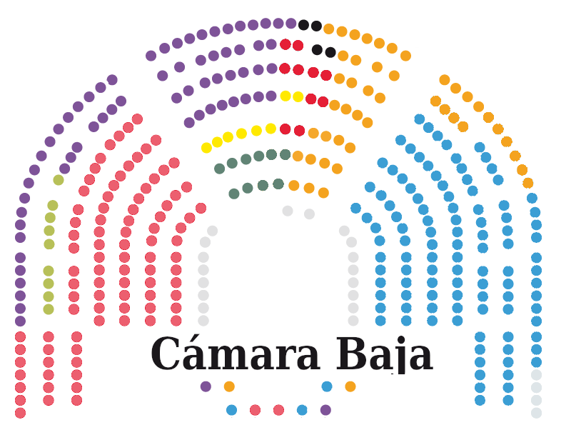

# Título del dataset

Diputados del Congreso de los diputados (Cámara Baja) de España (CBE)

# Subtítulo del dataset

Recopilación de todos los diputados del Congreso de los diputados (Cámara Baja) de España desde su constitución en 1977.

# Imagen

# Contexto

En la actual situación política Española donde entre los años 2011 al 2019 se producido 3 legislaturas, se hace necesario recopilar la información de las distintas constituciones de la cámara baja.

Los medios de comunicación informan sobre la distribución de dicha cámara en la última legislatura comparada con las encuestas.

Pero que mejor forma de contrastarla o poder ayudar a estructurar estos datos para futuros análisis, que automatizar la recopilación de información directamente de la página web del [Congreso de los diputados](http://www.congreso.es). De esta forma se puede facilitar la utilización de esta información por herramientas de terceros.

La página actual del Congreso de los diputados presenta la información únicamente en formato web y no existe ningún mecanismo de descarga.

# Contenido

El programa desarrollado permite la recopilación de los datos de todos los miembros de la cámara baja según el criterio del número de legislatura.

En el programa permite seleccionar una única legislatura o un rango de ellas. Esto permite una recopilación de todas ellas o si se ha investido una nuevo recopilar la información de la nueva.

Se ha implementado además un sistema de caché para evitar tener que repetir el proceso completo por causas de caída de la web o fallo en la conexión.

Además de la creación final de un fichero csv se permite en el formato json para facilitar el almacenamiento en alguna base de datos NOSQL o la implementación futura de un caché en este tipo de base de datos.

La información parte del apartado [diputados](http://www.congreso.es/portal/page/portal/Congreso/Congreso/Diputados) de la página oficial del congreso de los diputados.

Esta página tiene un desplegable para seleccionar la legislatura.

Es por ello que además la herramienta permite obtener dicho listado por pantall para evitar el acceso cuando se requiera la información.

Desde esta página inicial se va recorriendo el listado de cada una de las legislaturas y accedinedo a la página de detalle de cada uno de los diputados para obtener la información propia de cada uno.

Esta información se tendrá que recopilar de nuevo cada vez que se produzcan unas nuevas elecciones en España

## Descripción del Dataset

Cada informe que  se obtiene consta de los siguientes atributos

Atributo | Descripción|
|--------|-------------|
name | Nombre del Diputado|
mail | Correo electrónico personal|
party.name | Partido político por el que ha obtenido el escaño|
party.url | Link a la página web del partído político|
province | Provincia a la que representa en la cámara|
web | Página web personal del diputado|
url | Página web de donde se ha recopilado la información|
social.facebook | Página de perfil de facebook|
social.linkedin | Página de perfil de Linkedin|
social.twitter | Página de perfil de Twitter|
birthday.day | día de nacimiento|
birthday.month | mes de nacimiento|
birthday.year | año de nacimiento|
dates.entry_date | Fecha de alta como diputado|
dates.leaving_date | Fecha de baja como diputado|
legislature.start_year | Año de comienzo de la legislatura|
legislature.end_year | Año de finalización de la legislatura|
legislature.number | Número de la legistatura|
legislature.raw_name | Nombre de la legislatura completo|
legislature.roman_number | Número romano de la legislatura|

Los datos han sido recogidos en bruto y por lo tanto pueden tener inconsistencias.

# Agradecimientos
Agradecimemientos  a la [página oficial de Congreso de los Diputados de España](www.congreso.es) por mantener la información de todos los diputados.

Sin este mantenimiento no podríamos haber realizado este trabajo.

Además por haber incluido el fichero robots.txt para ayudarnos a evitar posibles caídas de las página web y orientarnos para evitar acceder a información obsoleta.

A [Stackoverflow](https://stackoverflow.com/) por esta base de datos de conocimiento que nos ayuda a solventar diariamente a los  pequeños y grandes duda que surgen durante la programación.

A [regex101](https://regex101.com/) por hacer más sencillo la creación de expresiones regulares.

# Inspiración

La noticias tanto vía web, televisión o prensa escrita que informan diariamente de la situación política.

Especialmente en época electoral donde aparece la información y gráficos comparando la situación actual del Congreso con las encuestas generadas.

Revisando la información que aparece en las páginas web de los periódicos, en la mayoría de los casos se da únicamente la información de como está conformada la cámara  en porcentaje según los partidos políticos, pero no hay una lista con nombres de los miembros.

Este dataset tiene la intención de añadir más información a dichos dataset. Por eso se recogen los nombres, datos de contacto, fecha de nacimiento y fecha de alta y baja en la cámara. Con esta información podemos ayudar a dar más información a aquellas personas que le interesen, como cuál es la edad media de la cámara, cuanto es el tiempo promedio de los congresistas en el parlamento. Si hay algún cambio de partido por parte de un miembro.

Además, se han añadido la información de las páginas web, correo, redes sociales para ver como estas herramientas se están introduciendo en los órganos del gobierno y si fuera de interés para poder seguir les en dichas redes sociales.

# Licencia

Este programa se ha desarrollado bajo la licencia [**CC BY-NC-SA 4.0 License**](https://creativecommons.org/licenses/by-nc/4.0/deed.es_ES).
Permitiendo la copia, distribución y el uso del dataset siempre y cuando se reconozca y cite al autor, con fines no comerciales.

También se permite que otros puedan contribuir creado trabajos derivados siempre y cuando lo hagan bajo una licencia idéntica.

Usted es libre de:

- **Compartir** — copiar y redistribuir el material en cualquier medio o formato
- **Adaptar** — remezclar, transformar y crear a partir del material
El licenciador no puede revocar estas libertades mientras cumpla con los términos de la licencia.

Bajo las condiciones siguientes:

- **Reconocimiento** — Debe reconocer adecuadamente la autoría, proporcionar un enlace a la licencia e indicar si se han realizado cambios<. Puede hacerlo de cualquier manera razonable, pero no de una manera que sugiera que tiene el apoyo del licenciador o lo recibe por el uso que hace.

- **NoComercial** — No puede utilizar el material para una finalidad comercial.

# Código

El código se encuentra disponible en

[https://github.com/tanakafer/camaraBaja](https://github.com/tanakafer/camaraBaja)

# Dataset

Se han generado un único dataset en dos formatos csv y json disponibles en le directory output de github

[https://github.com/tanakafer/camaraBaja](https://github.com/tanakafer/camaraBaja)

# Estructura de Ficheros y Carpetas

**cbe_crawler.py:** Programa ejecutable. Para más ayuda

>python cbe_crawler.py -h

 **output:** Carpeta donde se almacena el resultado de la ejecución

   - **congreso.csv:** fichero de salida en formato csv

   - **congreso.json:** fichero de salida en formato json

 **pandoc.sh:** Fichero ejecutable para convertir Markdown a pdf. Necesario instalación de docker

 **practica1.pdf:** Documento de respuestas pdf

 **README.md:** Fichero origen del documento de respuestas

**cache:** Carpeta de almacenamiento del caché

**images:** Carpeta de almacenamiento de las imágenes auxiliares

**uoc.tex:** Plantilla de conversión Markdown a pdf y docx

# Contribuciones

| Contribuciones | Firma |
|----------------|-------|
| Investigación previa| FRL|
| Redacción de las respuestas | FRL|
| Desarrollo código | FRL |
